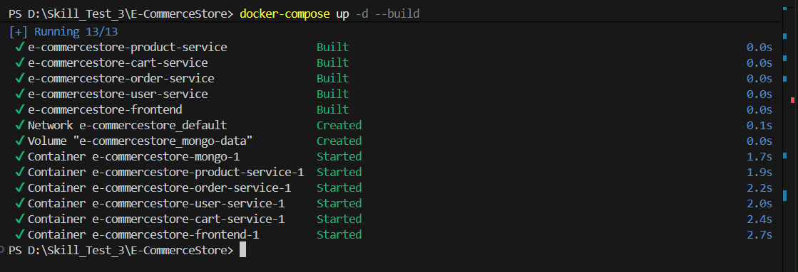
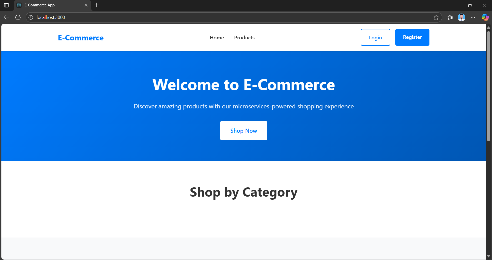
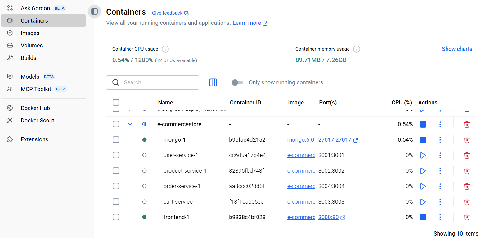
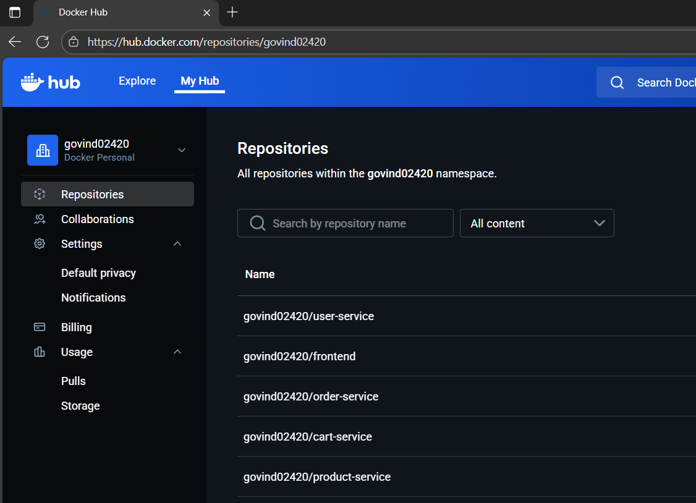
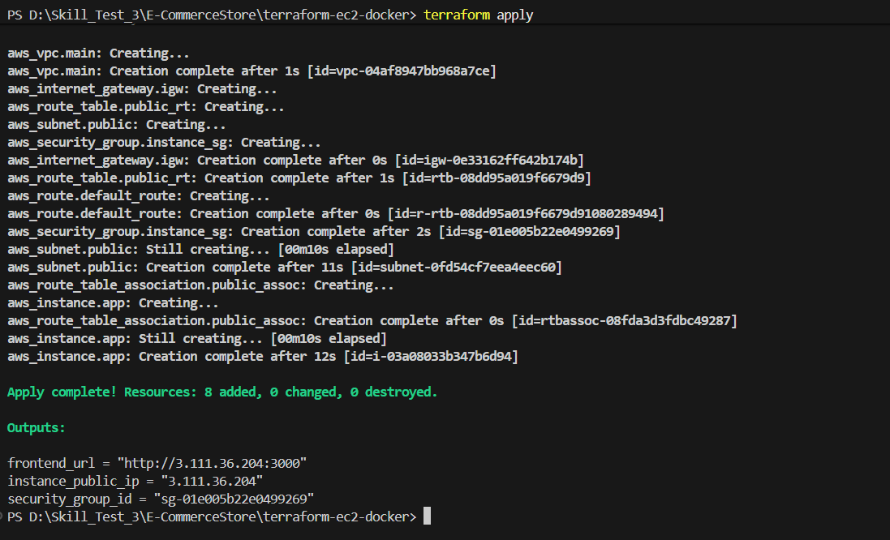
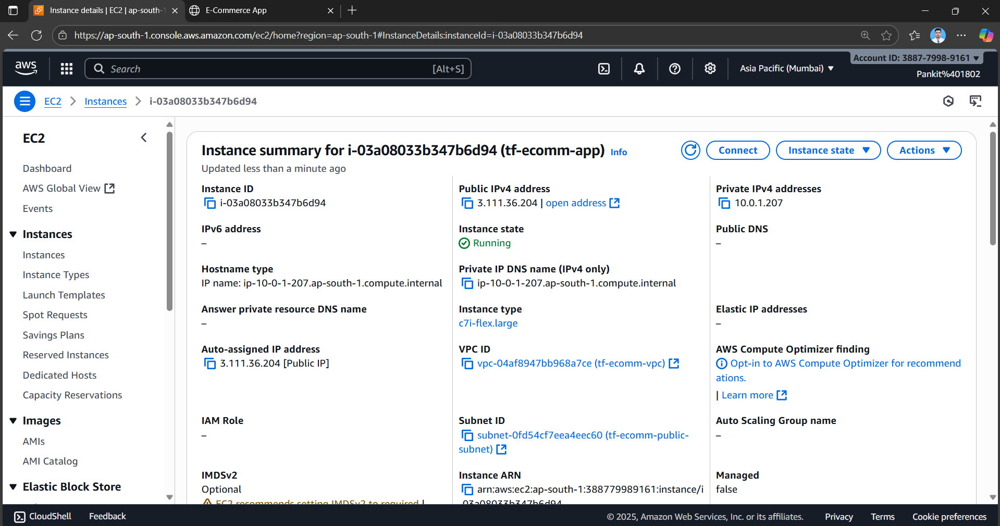
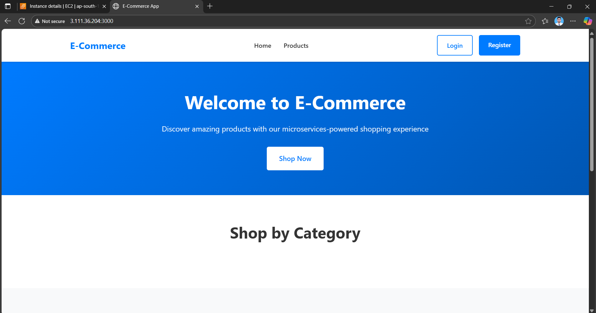
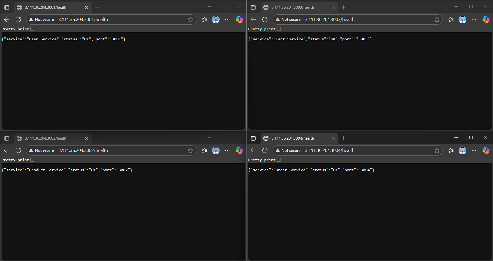
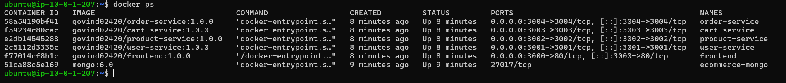

# 🛒 E-commerce Application with Terraform & Docker on AWS

This project provisions infrastructure and deploys a Node.js-based e-commerce application on AWS EC2 using Terraform and Docker. The application has:
  - **4 backend services**:```user-service```,```product-service```,```cart-service```,```order-service```
  - **1 frontend service**
  - **MongoDB database**

All services run as Docker containers inside an Ubuntu 22.04 EC2 instance. Terraform provisions the infrastructure (VPC, Subnet, Security Groups, EC2) and uses a userdata.tpl script to install Docker, pull images from DockerHub, and run the containers.
#
## 📖 1. Project Introduction

### 🏗️ Architecture Overview

- **User Service** → Authentication & profiles (3001)
- **Product Service** → Product catalog (3002)
- **Cart Service** → Shopping cart (3003)
- **Order Service** → Orders & payments (3004)
- **Frontend (React)** → Web UI (3000)
- **MongoDB** → Data persistence (running in a container 27017)

The services communicate internally via a custom Docker network (ecommerce-net). The frontend is publicly exposed for user access.

```bash
                 Internet
                    |
            [Security Group]
       (SSH 22, HTTP 80, 3000-3004)
                    |
                 Public Subnet
                    |
                EC2 Instance
          (Ubuntu 22.04 - Docker host)
                    |
             Docker Network: ecommerce-net
  --------------------------------------------------
  |         |          |          |         |      |
mongo    frontend     user     product    cart   order
(27017) (3000->80)   (3001)    (3002)    (3003)  (3004)
```

### 📁 Project Structure

```
E-CommerceStore/              # Codebase
│
├── backend/                       # All backend microservices
│   ├── user-service/
│   │   ├── Dockerfile
│   │   ├── package.json
│   │   └── server.js
│   │
│   ├── product-service/
│   │   ├── Dockerfile
│   │   ├── package.json
│   │   └── server.js
│   │
│   ├── cart-service/
│   │   ├── Dockerfile
│   │   ├── package.json
│   │   └── server.js
│   │
│   └── order-service/
│       ├── Dockerfile
│       ├── package.json
│       └── server.js
│
├── frontend/
│   ├── Dockerfile
│   ├── package.json
│   └── src/...
│
├── docker-compose.yml             # For local testing of all 5 services
├── README.md                      # Documentation for the whole project
│
├── terraform-ec2-docker/          # Infrastructure (Terraform)
│   ├── main.tf
│   ├── variables.tf
│   ├── outputs.tf
│   ├── userdata.tpl
│   └── terraform.tfvars (gitignore this sensitive info inside)
│
└── Screenshots/                          # Evidence/screenshots
    ├── docker-build-test.png
    ├── dockerhub-push.png
    ├── terraform-apply.png
    └── app-running.png

```
#
## 🐳 2. Build Docker Images

Each service has its own Dockerfile. Example for ```user-service```:
```bash
FROM node:18-alpine
WORKDIR /app
COPY package*.json ./
RUN npm install --production
COPY . .
EXPOSE 3001
CMD ["npm", "start"]
```
## Build & Tag Images Locally
```bash
# User Service
docker build -t <dockerhub_username>/user-service:1.0.0 ./backend/user-service

# Product Service
docker build -t <dockerhub_username>/product-service:1.0.0 ./backend/product-service

# Cart Service
docker build -t <dockerhub_username>/cart-service:1.0.0 ./backend/cart-service

# Order Service
docker build -t <dockerhub_username>/order-service:1.0.0 ./backend/order-service

# Frontend
docker build -t <dockerhub_username>/frontend:1.0.0 ./frontend

```
#
## 🖥️ 3. Test Locally with Docker Compose
Use ```docker-compose.yml``` to spin up all services locally:
```bash
docker-compose up --build
```
Access the services:
- Frontend → http://localhost:3000
- User Service → http://localhost:3001
- Product Service → http://localhost:3002
- Cart Service → http://localhost:3003
- Order Service → http://localhost:3004

#
### Push to Docker Hub
```bash
docker login
docker push <dockerhub_username>/user-service:1.0.0
docker push <dockerhub_username>/product-service:1.0.0
docker push <dockerhub_username>/cart-service:1.0.0
docker push <dockerhub_username>/order-service:1.0.0
docker push <dockerhub_username>/frontend:1.0.0
```
#
## 🌍 4. Terraform on AWS
### Prerequisites
- AWS CLI configured (aws configure)
- Terraform v1.5+
- Docker Hub account (public images or credentials)

### Terraform Structure
```bash
terraform-ec2-docker/
├── main.tf # VPC, Subnet, Security Groups, EC2
├── variables.tf # Configurable inputs
├── outputs.tf # Useful outputs (IP/DNS)
├── userdata.tpl # Script to install Docker & run containers
└── terraform.tfvars # Your secrets (ignored in git)
```

### Initialize & Apply
```bash
cd terraform-ec2-docker
## Initialize Terraform
terraform init
## Plan Infrastructure
terraform plan
## Apply Infrastructure
terraform apply
```
Terraform provisions:
- VPC with public subnet
- Security group (ports 22, 80, 3000–3004)
- EC2 Ubuntu 22.04 instance
- User data script (userdata.tpl) that:
  - Installs Docker
  - Creates Docker network
  - Runs MongoDB + all 5 services

### Outputs
After ```terraform apply```, outputs will include:
- Public IP of EC2
- Frontend URL → http://<public_ip>:3000

## 🖼️ 5. Screenshots

Include in ```/Screenshots```:

- **docker-build-test.png** → Local build success

- **local-test.png** → Frontend success

- **dockerhub-push.png** → Images pushed to Docker Hub


- **terraform-apply.png** → Successful infrastructure provisioning




- **app-running.png** → Frontend accessible in browser


#
## ✅ Verification

SSH into your EC2 and check running containers:
```bash
ssh -i <your-key.pem> ubuntu@<public-ip>
docker ps
``` 
**Output**:

#
## 🔒 Notes
- Add terraform.tfvars to .gitignore (contains sensitive credentials).
- Restrict SSH (22) access to your IP for security.
- Scale horizontally with ECS or EKS for production-ready deployments.

#
## 📝 License

This project is licensed under the MIT License.
#
🎯 This project is designed for learning and practice in DevOps, Terraform, and Docker on AWS. Perfect for beginners looking to deploy real-world microservices!
